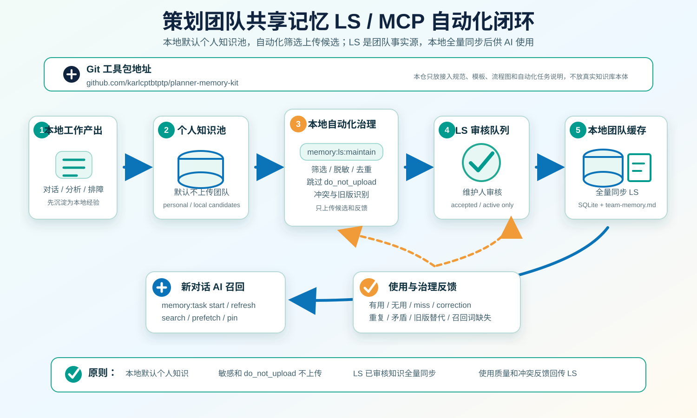

# Planner Memory Kit

策划团队共享记忆接入工具包：把远端 **MCP 团队记忆库** 中已审核、可同步的团队知识，同步成本机 AI 可以高速召回的本地缓存。

本仓只提供接入规范、项目模板、同步适配示例和流程说明；**不包含 MCP 团队记忆库服务本体**。

## 核心约定

- MCP 团队记忆库是远端团队事实源。
- 本机 SQLite 和 `03_memory/shared/` 是每个项目 AI 的运行缓存。
- Git 只放工具、模板、字段契约和说明，不放真实知识库本体。
- 投稿默认未审核；维护人审核通过后，才允许进入项目 AI 缓存。
- 本机只回传聚合使用反馈，不上传原始对话和敏感上下文。
- 飞书多维表格同步保留为 legacy 适配，不再是推荐主链路。

## 新版流程



1. 安装 Git 工具包。
2. 配置 MCP 团队记忆库地址、项目代号、用户/Agent 身份和访问凭据。
3. 策划或 Agent 投稿到 MCP 团队记忆库，默认进入待审核队列。
4. 项目知识维护人审核真实性、复用性、权限和项目范围。
5. 本机同步已审核、可见、未冻结的知识到本地 SQLite / Markdown 缓存。
6. 新对话 AI 基于本地缓存召回知识，并把召回、采纳、遗漏、纠错等反馈聚合回传 MCP。

## 快速开始

```powershell
npm install
npm test
```

在接入项目里推荐暴露这些命令：

```json
{
  "scripts": {
    "memory:sync:mcp": "tsx 90_tools/planner-memory-kit/src/sync-mcp.ts",
    "memory:mcp:push-usage": "tsx 90_tools/planner-memory-kit/src/push-usage-mcp.ts",
    "memory:sync:feishu": "tsx 90_tools/planner-memory-kit/src/sync-feishu.ts"
  }
}
```

> 当前仓库保留 Feishu legacy 同步代码；MCP 同步代码属于接入适配层，按 `docs/MCP_TEAM_MEMORY_IMPLEMENTATION.md` 的契约在项目内实现或接入团队已有 MCP 服务。

推荐环境变量：

```powershell
$env:MCP_MEMORY_ENDPOINT="https://memory.example.com/mcp"
$env:MCP_MEMORY_TOKEN="<read_from_local_vault_or_env>"
$env:PROJECT_ID="giftWeb"
$env:ACTOR_ID="planner-ai-local"
```

同步命令形态：

```powershell
cmd /c npm run memory:sync:mcp -- --project "giftWeb" --dry-run
cmd /c npm run memory:sync:mcp -- --project "giftWeb"
cmd /c npm run memory:mcp:push-usage -- --project "giftWeb"
```

PowerShell 下推荐加 `cmd /c`，避免 npm 把 `--project`、`--dry-run` 误解析成 npm 自己的参数。

## 同步硬闸门

会同步：

- `knowledge_items.status = accepted`
- `principles.status = active`
- `project_id` 命中当前项目，或知识明确是全项目可见
- `clearance` 不高于本机/当前 Agent 权限
- 未被冻结、未归档、未标记删除
- 通过敏感内容扫描

会拦截：

- 未审核、待补充、废弃、冻结、垃圾知识
- 个人知识、其它项目专属知识、权限不足知识
- token、secret、password、cookie、数据库连接串、私钥
- `99_runtime/`、`state/`、`.env`、`.Codex/settings.local.json`、`.cursor/mcp.json`

## 文档

- [MCP 团队记忆实施方案](docs/MCP_TEAM_MEMORY_IMPLEMENTATION.md)
- [本地项目三模块搭建方案](docs/LOCAL_PROJECT_SETUP.md)
- [落地包说明](docs/ROLLOUT_PACKET.md)
- [端到端测试方案](docs/E2E_TEST_PLAN.md)
- [项目 AGENTS 模板](docs/AGENTS.template.md)
- [飞书字段模板 legacy](docs/FEISHU_FIELDS.md)

## 本地项目三模块

每个项目按三块搭建：

| 模块 | 推荐目录 | 作用 |
|---|---|---|
| 智能体记忆 | `03_memory/` | AI 启动、召回、同步后的团队知识缓存 |
| 个人工具 | `90_tools/personal/` | 每个策划自己的脚本、快捷命令、临时助手工具 |
| 项目产出 | `02_outputs/` | 分析报告、策划案草稿、评审材料、交付物 |

可复制模板见 `templates/local-project/`。

## 飞书 legacy

旧版飞书多维表格同步仍可运行：

```powershell
cmd /c npm run memory:sync:feishu -- --source fixtures/feishu-memory.sample.json --dry-run
```

它适合历史项目继续使用；新项目推荐走 MCP 团队记忆库。
